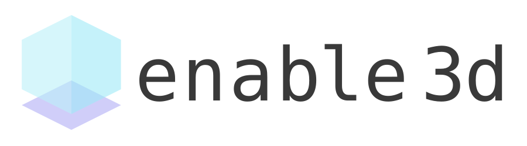

# The Duel

<p align="center">
  <a href="https://opensource.org/licenses/MIT" title="License: MIT" >
    
  </a>
  <a href="https://github.com/prettier/prettier" alt="code style: prettier"></a>
</p>

<p align="center">
  <a href="#key-features">Key Features</a> •
  <a href="#preview">Preview</a> •
  <a href="#how-to-use">How To Use</a> •
  <a href="#enable3d">enable3d</a> •
  <a href="#progressive-web-app-pwa">PWA</a> •
  <a href="#custom-configurations">Custom Configurations</a> •
  <a href="#useful-links">Useful Links</a> •
  <a href="#multiplayer-game">Multiplayer Game</a> •
  <a href="#examples">Examples</a> •
  <a href="#credits">Credits</a> •
  <a href="#license">License</a>
</p>

---

## Key Features

- **ESNext** features ready (async/await, Rest/Spread operators)
- Code Splitting
- Obfuscation
- Development Server with SourceMap and Live-Reload
- PWA ready with offline support and "Add to Home screen" install prompt
- Includes Phaser 3 TypeScript typings
- For development and production builds
- Adds a webpack ContentHash to the JavaScript files (in production)

## How To Use

To clone and run this template, you'll need [Git](https://git-scm.com) and [Node.js](https://nodejs.org/en/download/) (which comes with [npm](http://npmjs.com)) installed on your computer. From your command line:

```bash
# Clone this repository
$ git clone https://github.com/condini-mastheus/the-duel

# Go into the repository
$ cd the duel

# Install dependencies
$ npm install

# Start the local development server (on port 8080)
$ npm start

# Ready for production?
# Build the production ready code to the /dist folder
$ npm run build

# Play your production ready game in the browser
$ npm run serve
```

All your game code lies inside the **/src/scripts** folder. All assets need to be inside the **/src/assets** folder in order to get copied to /dist while creating the production build. Do not change the name of the index.html and game.ts files.

## enable3d

<a href="https://github.com/yandeu/enable3d#readme"></a>

Want to add 3D objects and physics to your Phaser game? Checkout [enable3d](https://github.com/yandeu/enable3d#readme)!

## Progressive Web App (PWA)


This template is **100% PWA ready**.

The ServiceWorker is **disabled by default** and is configured to only work in **production mode**.  
Uncomment the line below inside /src/index.html to enable it.

```html
<script>
  if ('serviceWorker' in navigator) {
    window.addEventListener('load', () => {
      navigator.serviceWorker.register('./sw.js')
    })
  }
</script>
```

You can easily personalize its settings by following these steps:

- Replace both icons in /pwa/icons with your own.
  - One is **512x512** the other **192x192**
- Add your own **favicon.ico** to /src
- Adjust these parameters in the **manifest.json** file in /pwa
  - **short_name**: Max. 12 characters
  - **name**: The full game name
  - **orientation**: "landscape" or "portrait"
  - **background_color**: color of the splash screen
  - **theme_color**: color of the navbar - has to match the theme-color in the index.html file
- You can leave the **sw.js** (serviceWorker) in /pwa how it is.
- Change the **gameName** in /webpack/webpack.common.js

Read more about PWA on [developers.google.com](https://developers.google.com/web/progressive-web-apps/)

## Custom Configurations

### TypeScript Compiler

Change the TypeScript compiler's settings in the tsconfig.json file.

If you are new to TypeScript, you maybe want to set **"noImplicitAny"** to **false**.

You'll find more information about the TypeScript compiler [here](https://www.typescriptlang.org/docs/handbook/compiler-options.html).

### Typings

You can put your custom type definitions inside typings/**custom.d.ts**.

### Webpack

All webpack configs are in the **webpack** folder.

### Obfuscation

_Obfuscation is disabled by default._

We are using the [webpack-obfuscator](https://github.com/javascript-obfuscator/webpack-obfuscator). Change its settings in webpack/webpack.prod.js if needed. All available options are listed [here](https://github.com/javascript-obfuscator/javascript-obfuscator#javascript-obfuscator-options).


## Multiplayer Game

Making a multiplayer game? Check out [geckos.io](https://github.com/geckosio/geckos.io#readme)

## Useful Links

- [Phaser Website](https://phaser.io/)
- [Phaser 3 Forum](https://phaser.discourse.group/)
- [Phaser 3 API Docs](https://photonstorm.github.io/phaser3-docs/)
- [Official Phaser 3 Examples](http://labs.phaser.io/)
- [Notes of Phaser 3](https://rexrainbow.github.io/phaser3-rex-notes/docs/site/index.html)

## Credits

- A huge thank you to Rich [@photonstorm](https://github.com/photonstorm) for creating Phaser

- A huge thank you to Yannick Deubel [@yandeu](https://github.com/yandeu) for creating this template
